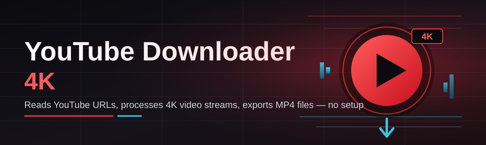

# youtube-4k-download-helper 🎬⚡

  

*A quiet, purpose-built bridge between the videos you love and the storage you control.*

  

## 📼 Overview

**youtube-4k-download-helper** is a lightweight Windows companion for pulling YouTube video into a local file at the highest resolution the source actually offers — up to native 4K where the upload supports it. It was built on a simple observation: most "downloader" tools on the market are either bloated with ad-tech, buried under browser extensions with excessive permissions, or so feature-heavy that opening them feels like boarding a plane. This project takes the opposite approach — one window, one input field, one clear action.

<strong>📖 The origin story — why this repository exists</strong>

 

This started as a personal utility. Streaming is wonderful when the network cooperates, the video isn't geo-shuffled between quality tiers, and you always have signal. Reality is messier — flights, rural links, conference wifi that throttles video traffic, or simply wanting to archive a tutorial before it's taken down or re-edited. Existing solutions either lagged behind YouTube's constantly shifting delivery formats or shipped with telemetry nobody asked for.

So this tool was rebuilt from first principles: a small native Windows binary, no background services, no silent updater phoning home, and a UI that respects the fact that you came here to get a file, not to be upsold. Over time, the project grew audio-only exports, batch queues, and subtitle handling — but the core philosophy never changed.

The intended audience is broad but specific: educators archiving reference material, video editors pulling source footage for offline review, travelers preloading long-form content, and archivists who simply believe that things worth watching are worth keeping. If you have ever thought "I just want the file, not a subscription," this project speaks directly to you.

> [!NOTE]
> This tool is designed for content you have the right to download — your own uploads, material licensed for reuse, or videos explicitly marked downloadable by their creator. Respect creator rights and YouTube's Terms of Service.

---

## 🧩 What Sets It Apart

- **Resolution-aware fetching** — the tool inspects every available stream manifest before committing to a download, so you get true 4K (2160p) when the source provides it, rather than an upscaled imitation dressed up as high quality.

- **Audio-video remuxing done right** — YouTube 4K delivers video and audio as separate streams; this tool merges them losslessly into a single container instead of leaving you with two orphaned files.

- **Batch queue architecture** — paste ten links or one hundred; the queue processes them sequentially with independent retry logic per item, so one broken link never stalls the rest.

- **Subtitle and chapter capture** — closed captions and chapter markers are pulled alongside video when present, preserving context that a bare video file would lose.

- **Format flexibility without clutter** — choose MP4, MKV, or audio-only extraction (M4A/MP3) from a single dropdown rather than hunting through nested settings menus.

- **Offline-first design** — once a video is fetched, everything else — renaming, format conversion, metadata tagging — happens locally with zero network dependency.

- **Adaptive throttling** — download speed can be capped intentionally, useful on shared or metered connections where saturating bandwidth isn't polite.

- **Portable execution mode** — an optional standalone `.exe` variant runs from a USB stick without touching the registry, for people who don't want another installed program on a shared machine.

  

---

## 🚀 Getting Started

1. Visit the landing page using the download button above or below — this is the only distribution point for the tool.

2. Download the current build for Windows; no separate installer package is required.

3. Run the executable directly. Windows SmartScreen may prompt on first launch for unsigned binaries — this is expected for a small independently maintained project.

4. Paste a YouTube URL into the input field, select your desired resolution and format, and press **Start**.

> [!TIP]
> Hold **Ctrl** while pasting a URL to auto-queue it without opening the resolution picker — useful when you already know you want the highest available quality every time.

---

## 🖥️ System Requirements

| Component | Minimum | Recommended |
|---|---|---|
| **OS** | Windows 10 (64-bit, version 1909+) | Windows 11 (64-bit, latest update) |
| **RAM** | 4 GB | 8 GB or more |
| **Disk** | 200 MB free (application) + space for downloaded media | 1 GB+ free for comfortable batch queues and 4K file sizes |

> [!IMPORTANT]
> 4K video files are large by nature — a ten-minute 2160p clip can exceed 1–2 GB depending on bitrate. Ensure your target drive has headroom before queuing long-form content.

No third-party runtime, codec pack, or browser extension is required. The application is self-contained by design.

---

## ⚙️ How It Works

The internal pipeline is intentionally short, because every extra stage is a place where something can go stale when YouTube changes its delivery format. At a high level:

1. **URL parsing** — the input link is normalized and validated (handles shortened links, playlist entries, and timestamped URLs).

2. **Manifest inspection** — the tool queries available stream variants to determine the true maximum resolution and codec options for that specific video.

3. **Stream retrieval** — video and audio streams are fetched, often in parallel, since 4K sources are typically split into separate tracks.

4. **Remux & finalize** — streams are merged into the chosen container, metadata and subtitles are attached, and the file is moved to your output folder.

5. **Verification pass** — a lightweight integrity check confirms the output file plays before it's marked complete in the queue.

---

## 🔧 Troubleshooting

**Q: The download stalls at a specific percentage and never finishes.**
A: This usually indicates a throttled connection or a temporarily rate-limited stream endpoint. Pause the queue for a minute and resume — the retry logic will re-request the affected segment.

**Q: I selected 4K but the output looks like 1080p.**
A: Not every video is uploaded in 4K by its creator, even if the platform shows a 2160p option elsewhere. The manifest inspector reports only what the source actually contains — it does not upscale.

**Q: Audio is missing after conversion to MP4.**
A: This typically points to a remux failure caused by an interrupted download. Re-queue the video; the tool will re-fetch both tracks rather than reuse a partial file.

**Q: Windows SmartScreen is blocking the executable.**
A: This is standard behavior for independently signed or unsigned small-project binaries. Click "More info" → "Run anyway" if you trust the source, or verify the checksum published on the landing page.

**Q: Subtitles didn't download even though the video has captions.**
A: Auto-generated captions on some videos are region-locked or delayed in availability; try again after a few minutes, or disable subtitle fetching if the video only has auto-captions you don't need.

**Q: Batch queue skipped one link entirely.**
A: Usually caused by an invalid or private URL. Check the queue log panel — it records the specific reason next to the skipped entry.

---

## 🎨 Interface & Experience

The interface favors clarity over density — a single primary pane for the queue, a slim sidebar for settings, and nothing competing for attention.

| Shortcut | Action |
|---|---|
| `Ctrl + V` | Paste and auto-detect URL |
| `Ctrl + Enter` | Start queue |
| `Ctrl + Shift + C` | Clear completed items |
| `F2` | Rename output file before saving |
| `Ctrl + ,` | Open settings panel |

- **Themes** — Light, Dark, and an automatic mode that follows Windows' system theme.
- **Compact mode** — collapses the queue into a minimal list for users running the tool alongside other windows.
- **Notification control** — optional toast on completion, silence-friendly for background batch runs.

> [!TIP]
> Right-click any completed item to reveal a quick-actions menu: open containing folder, re-download at a different resolution, or copy the original source link.

---

## 🤝 Contributing & Community

Contributions are welcome, particularly around format compatibility, subtitle parsing edge cases, and translation of the interface into additional languages.

- Open an issue describing the behavior you're seeing, ideally with a sanitized example URL and your Windows build number.
- Fork the repository, branch from `main`, and keep pull requests focused on a single change.
- Discussion threads are the right place for feature proposals before implementation work begins — this avoids duplicated effort.

> [!WARNING]
> Please do not submit pull requests that add telemetry, third-party analytics SDKs, or bundled installers for unrelated software. These will be closed without merge, regardless of the feature they accompany.

---

## 📜 License

Released under the [MIT License](LICENSE), 2026. You are free to use, modify, and redistribute this project within the terms of that license.

---

## ⚠️ Disclaimer

This tool is provided for personal archiving and offline viewing of content you are authorized to download. It does not host, mirror, or distribute copyrighted video itself — it simply automates a fetch-and-save operation initiated by the user. Downloading content you do not have rights to may violate YouTube's Terms of Service and applicable copyright law in your jurisdiction. Use responsibly and at your own discretion.

---

